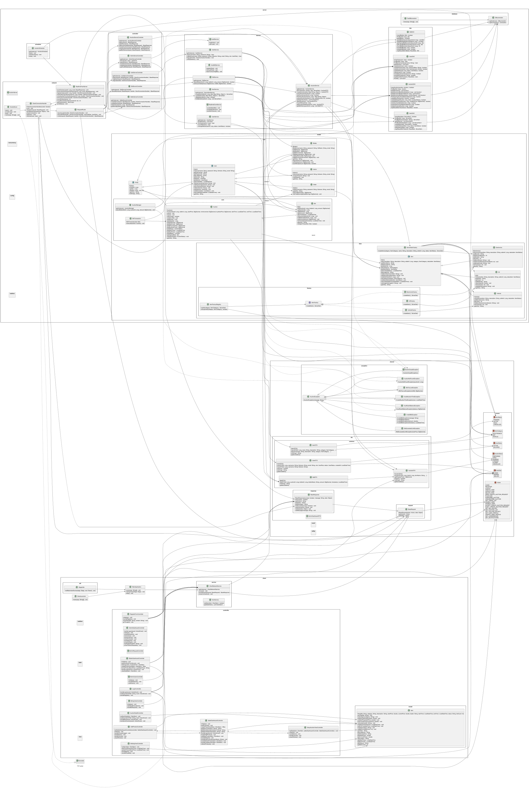

[](https://github.com/trdat19/G3_Bidding_Online/actions/workflows/maven.yml)

# HỆ THỐNG ĐẤU GIÁ TRỰC TUYẾN - BIDZONE
## Nhóm 3 - 2526II_UET.CS2043_3

---

## 1. Giới thiệu hệ thống
BidZone là hệ thống hỗ trợ tổ chức và tham gia đấu giá trực tuyến.

Hệ thống được xây dựng theo kiến trúc Client-Server: client JavaFX cung cấp giao diện người dùng, server xử lý nghiệp vụ và trao đổi dữ liệu với cơ sở dữ liệu MySQL/TiDB qua JDBC.

Người dùng có thể đăng nhập, đăng bán sản phẩm, tham gia đấu giá sản phẩm theo thời gian thực và nhận cập nhật giá ngay lập tức.

Dự án được thực hiện cho bài tập lớn môn Lập trình nâng cao.

Hệ thống cho phép:
- **Admin**: Quản lý sản phẩm, người dùng, và yêu cầu tạo phiên trong hệ thống.
- **Seller**: Đăng bán sản phẩm, gửi yêu cầu tạo phiên, quản lý sản phẩm, quản lý doanh thu.
- **Bidder**: Theo dõi phiên đấu giá, tham gia đấu giá trực tuyến, quản lý ví.

Client và Server trao đổi request/response qua Java Socket. 
Các cập nhật trong phiên đấu giá được server đẩy theo thời gian thực tới các Client đang theo dõi.

---

## 2. Cấu trúc hệ thống
- **Server**: Xử lý logic chính, quản lý kết nối, lưu trữ dữ liệu.
- **Client**: Giao diện người dùng, gửi yêu cầu đến server, nhận phản hồi và hiển thị thông tin.
- **Database**: Lưu trữ thông tin người dùng, sản phẩm, phiên đấu giá, lịch sử đấu giá.

---

## 3. Công nghệ sử dụng
 - Ngôn ngữ: Java 21
 - Giao diện: JavaFX, FXML, CSS
 - Kiến trúc: Client-Server, phân lớp Controller - Service - DAO
 - Mô hình: MVC
 - Giao tiếp mạng: Java Socket, Object Stream
 - Cơ sở dữ liệu: TiDB Cloud / MySQL, JBDC
 - Connection pool: HikariCP
 - Build tool: Maven
 - Kiểm thử: JUnit 5, Mockito
 - CI: Github Actions
 - Đóng gói: Maven Shade Plugin tạo executable JAR

---

## 4. Yêu cầu môi trường
Trước khi chạy hệ thống, cần cài đặt:
 - JDK 21 hoặc cao hơn
 - Maven 3.8 hoặc cao hơn
 - MySQL hoặc tài khoản TiDB Cloud có Database phù hợp với hệ thống
 - JavaFX SDK nếu chạy trực tiếp bằng IDE
 - IntelliJ IDEA hoặc IDE tương đương
 - Kết nối mạng chung giữa Client và Server

Kiểm tra phiên bản Java, Maven:
```bash
java --version
mvn --version
```

---

## 5. Cấu hình hệ thống
Cập nhật file [`src/main/resources/config.properties`](src/main/resources/config.properties) trước khi build:

```properties
server.host = 26.198.98.181
server.port = 8888

db.url = jdbc:mysql://<host>:<port>/<database>?sslMode=VERIFY_IDENTITY
db.username = <database-username>
db.password = <database-password>
```

Trong đó:
- `server.host`: địa chỉ IP của máy Server mà Client kết nối tới
- `server.port`: cổng Socket mà Server lắng nghe
- `db.url`, `db.username`, `db.password`: thông tin kết nối MySQL/TiDB

---

## 6. Cấu trúc thư mục và module chính
```text
G3_Bidding_Online/
├── docs/                              # Sơ đồ thiết kế và tài liệu hệ thống
├── src/
│   ├── main/
│   │   ├── java/
│   │   │   ├── client/                # Ứng dụng JavaFX phía client
│   │   │   │   ├── controller/        # Controller cho các màn hình
│   │   │   │   ├── service/           # Giao tiếp Socket với server
│   │   │   │   └── session/           # Thông tin phiên đăng nhập
│   │   │   ├── server/
│   │   │   │   ├── network/           # Socket server, router và realtime push
│   │   │   │   ├── controller/        # Tiếp nhận và gọi service tương ứng với request
│   │   │   │   ├── service/           # Xử lý nghiệp vụ
│   │   │   │   ├── dao/               # Truy cập dữ liệu
│   │   │   │   ├── database/          # Kết nối database
│   │   │   │   ├── model/             # Model chính của hệ thống
│   │   │   │   └── scheduler/         # Tự động cập nhật trạng thái phiên
│   │   │   └── shared/                # DTO, request, response, enum, exception
│   │   └── resources/
│   │       ├── config.properties       # Cấu hình server và database
│   │       ├── view/                   # File giao diện FXML
│   │       ├── css/                    # Stylesheet JavaFX
│   │       └── image/                  # Tài nguyên hình ảnh (Logo,...)
│   └── test/java/                      # Unit test và integration test
├── target/                             # Kết quả build Maven
├── pom.xml
└── README.md
```

Sơ đồ lớp của hệ thống:



---

## 7. Build và bị trí các file JAR
Từ thư mục gốc của dự án, chạy lệnh:

```bash
mvn clean package
```

Sau khi build thành công, Maven tạo các file trong thư mục `target/`:

| File JAR | Mục đích |
| --- | --- |
| `target/G3_BiddingOnline-1.0-SNAPSHOT-server.jar` | Chạy Socket Server |
| `target/G3_BiddingOnline-1.0-SNAPSHOT-client.jar` | Chạy ứng dụng JavaFX Client |

---

##  8. Hướng dẫn chạy Server và Client
### Bước 1: Chuẩn bị cấu hình
Cập nhật `src/main/resources/config.properties`, sau đó build lại dự án bằng `mvn clean package`

### Bước 2: Chạy Server
Mở terminal thứ nhất tại thư mục gốc của dự án:

```bash
java -jar target/G3_BiddingOnline-1.0-SNAPSHOT-server.jar
```

Server sẽ kết nối database, lắng nghe tại `server.port` và khởi động bộ lập lịch cập nhật phiên đấu giá.

### Bước 3: Chạy Client
Sau khi server đã chạy, mở terminal thứ hai:

```bash
java -jar target/G3_BiddingOnline-1.0-SNAPSHOT-client.jar
```

Có thể mở nhiều client để kiểm thử đấu giá thời gian thực.

### Chạy trực tiếp bằng IDE

Nếu chạy trong IntelliJ IDEA hoặc IDE tương đương:

1. Chạy `server.network.SocketServer`.
2. Chờ server khởi động thành công.
3. Chạy `client.ClientLauncher`.

---

## 9. Chức năng đã hoàn thành

### Chức năng chung

- Đăng ký, đăng nhập, đăng xuất và đổi mật khẩu.
- Phân quyền theo vai trò Bidder, Seller và Admin.
- Giao tiếp Client-Server qua Socket.
- Cập nhật dữ liệu đấu giá theo thời gian thực.

### Bidder

- Xem danh sách và chi tiết phiên đấu giá.
- Theo dõi phiên quan tâm và tham gia phiên đấu giá.
- Đặt giá trực tiếp, xem lịch sử trả giá.
- Đăng ký và hủy luật tự động trả giá.
- Xem các phiên đã thắng.
- Xem số dư và nạp tiền vào ví.

### Seller

- Thêm, sửa, xóa và xem danh sách sản phẩm.
- Gửi yêu cầu tạo phiên đấu giá.
- Xem danh sách phiên đấu giá đã được duyệt.
- Xem tổng quan ví người bán và rút tiền.

### Admin

- Xem dashboard thống kê.
- Xem danh sách, bật và khóa tài khoản người dùng.
- Xem danh sách sản phẩm và phiên đấu giá.
- Duyệt hoặc từ chối yêu cầu tạo phiên đấu giá.

---

## 10. Báo cáo và video demo

- Báo cáo PDF: _https://drive.google.com/file/d/1-siIgf-ROlgKxeyknQ909ceOcURJFTEB/view?usp=sharing_
- Video demo: _https://drive.google.com/file/d/1vWKG5a669OAawddiPOi7_N5ShSS_HWmN/view?usp=sharing_
